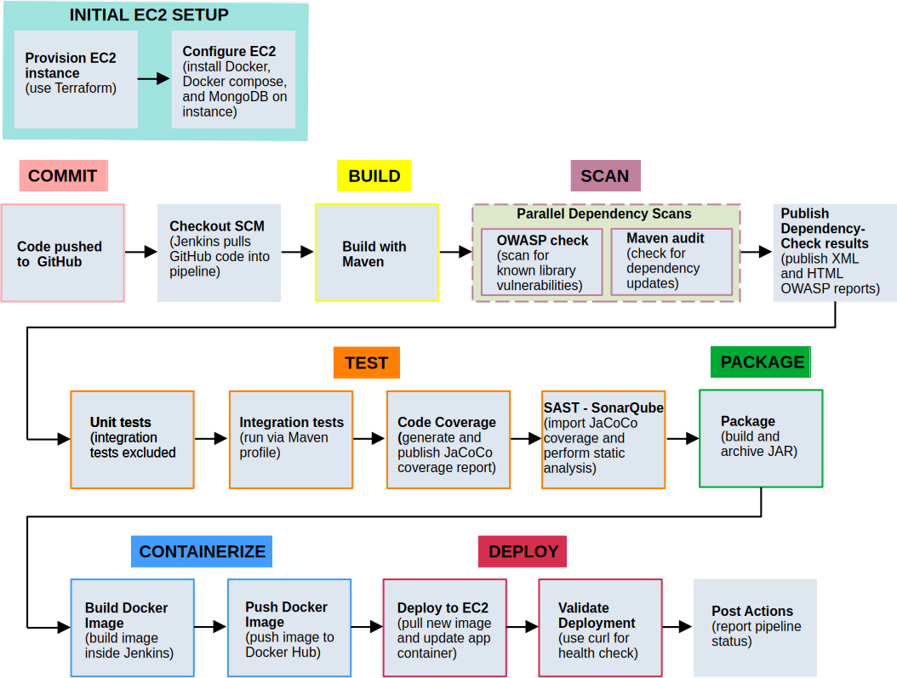
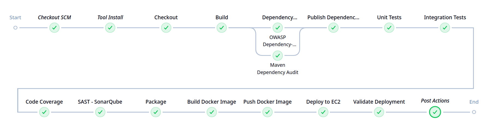
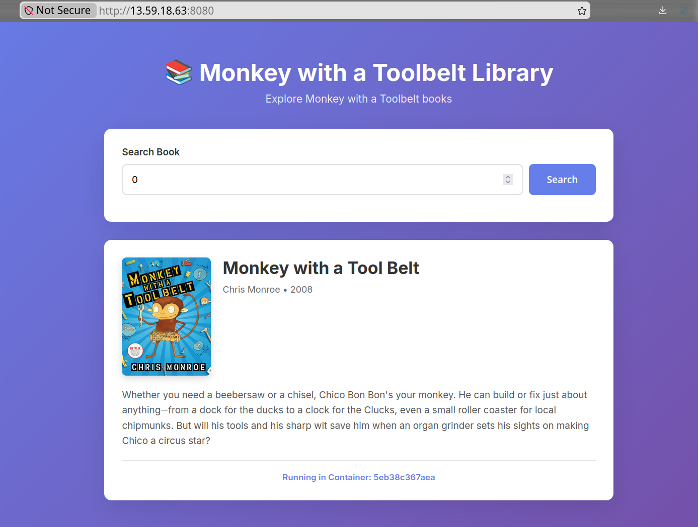
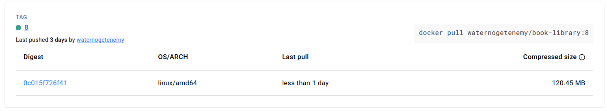
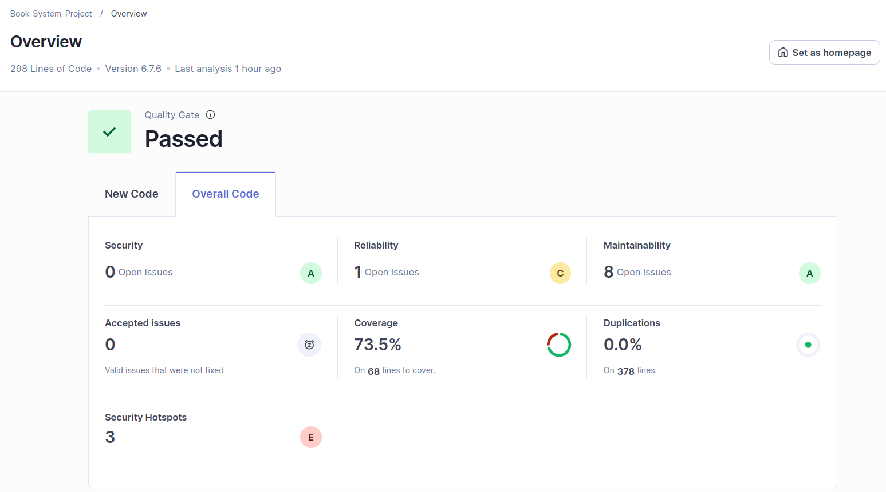
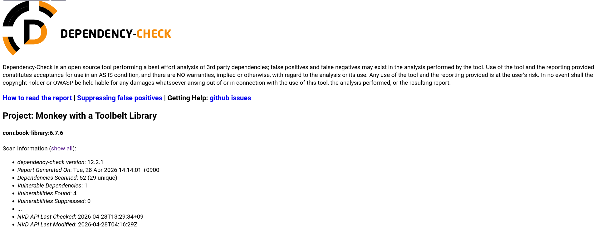
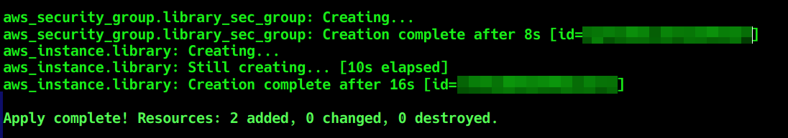

# CI/CD Pipeline for Spring Boot Book Library Application

## Overview
This project implements a secure CI/CD pipeline for a containerized Spring Boot and MongoDB application deployed to AWS EC2. It demonstrates practical DevOps skills through Jenkins automation, automated testing, dependency vulnerability scanning, static analysis, Docker image publishing, Terraform provisioning, and deployment validation.
 

## Workflow

 

## Tech Stack
- Java
- Maven
- Spring Boot
- MongoDB
- Jenkins
- OWASP Dependency-Check
- JUnit
- JaCoCo
- SonarQube
- Docker
- Terraform
- AWS EC2
 

## CI/CD Pipeline

| Stage | Purpose |
|:---|:---|
| * Checkout | Checks out the latest source code from GitHub. |
| * Build | Compiles the Maven project. |
| * Dependency Scanning Parallel | Runs dependency security and maintenance checks in parallel to reduce pipeline time. |
| * OWASP Dependency-Check | Scans project dependencies for known CVEs and stashes HTML/XML reports. |
| * Maven Dependency Audit | Lists outdated dependencies. |
| * Publish Dependency-Check Results | Publishes the OWASP XML results and HTML report in Jenkins. |
| * Unit Tests | Runs unit tests with Maven Surefire and publishes JUnit test results. |
| * Integration Tests | Runs integration tests separately and marks failures as `UNSTABLE` without stopping the pipeline. |
| * Code Coverage | Generates and publishes the JaCoCo coverage report. Coverage issues are marked `UNSTABLE`. |
| * SAST - SonarQube | Runs static analysis with SonarQube to identify code quality and security issues. |
| * Package | Packages the application JAR and archives it as a Jenkins build artifact. |
| * Build Docker Image | Builds a Docker image for the Spring Boot application. |
| * Push Docker Image | Authenticates to Docker Hub and pushes the image. |
| * Deploy to EC2 | Copies `docker-compose.yml` to the EC2 instance, pulls the latest application image, and starts the deployment with Docker Compose. |
| * Validate Deployment | Waits for startup, then sends a `curl` health check request to confirm the application is reachable on EC2. |

 

## Security and Quality Controls

This pipeline includes several DevSecOps controls:

- OWASP Dependency-Check scans third-party dependencies for known CVEs.
- The build fails when a dependency has a critical CVSS score.
- SonarQube performs static analysis for bugs, vulnerabilities, code smells, and security hotspots.
- Jenkins credentials are used for Docker Hub, AWS, SonarQube, and NVD API tokens.
- MongoDB is isolated inside the Docker Compose network and is not exposed publicly.
 

## Deployment Architecture

Terraform provisions the AWS EC2 infrastructure used for deployment. Jenkins then builds and pushes a versioned Docker image to Docker Hub, copies `docker-compose.yml` to the EC2 instance, deploys the updated service with Docker Compose, and validates the deployment with a health check.
 

## Application Features

- Displays a simple browser-based library interface.
- Retrieves book data from a MongoDB database.
- Uses a Spring Boot backend to serve application data to the frontend.
- Runs as a containerized application for consistent deployment across environments.
 

## Screenshots

### Jenkins Pipeline

### Deployed Application

### Docker Hub Image

### SonarQube Analysis

### OWASP Dependency-Check

### Terraform Provisioning

 

## How to Run App Locally
1. Import `data/book_data.json` into MongoDB.
2. Run the application with `mvn spring-boot:run`.
3. Open http://localhost:3001 in your browser.

 

## Pre-deployment Setup
Before running the pipeline, configure the following:

- Jenkins tools: Maven `M3` and `OpenJDK 21`
- Required Jenkins plugins: JUnit, HTML Publisher, OWASP Dependency-Check, SonarQube Scanner, SSH Agent, AWS Credentials, and Credentials Binding
- Jenkins credentials:
  - `nvd-api-key`
  - `sonar-token`
  - `docker-credentials`
  - `ec2-ssh-key`
- SonarQube running locally and reachable at http://localhost:9000
- Docker installed on the Jenkins host
 

## How to Deploy
1. Use Terraform to provision the AWS EC2 instance. 
2. Install Docker, Docker Compose, and MongoDB on the EC2 instance. 
3. Run the Jenkins pipeline to build, test, scan, package, and push the Docker image. 
4. Copy `data/book_data.json` to the EC2 instance and import it into MongoDB. 
5. Confirm the deployment at `http://<ip>:8080`.
 

*This project was adapted from a small Java/Spring Boot application and extended into a full CI/CD deployment pipeline.
